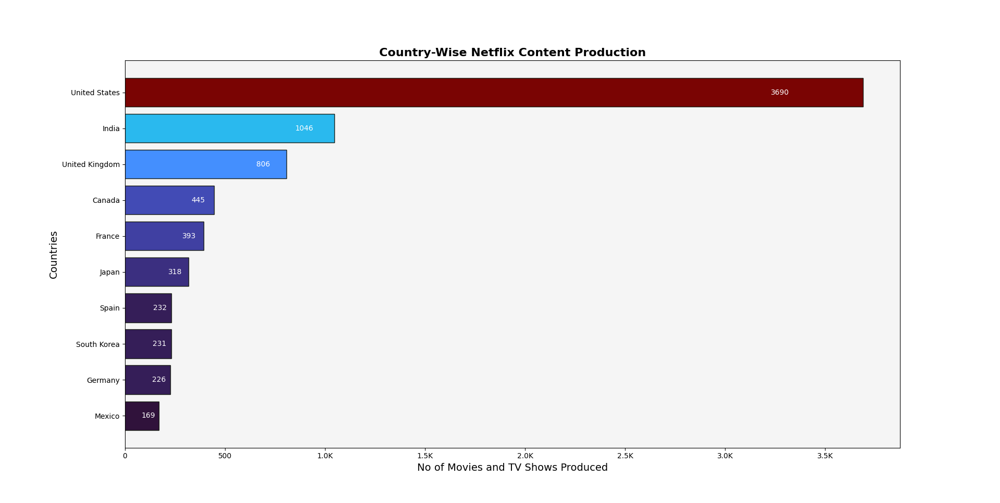
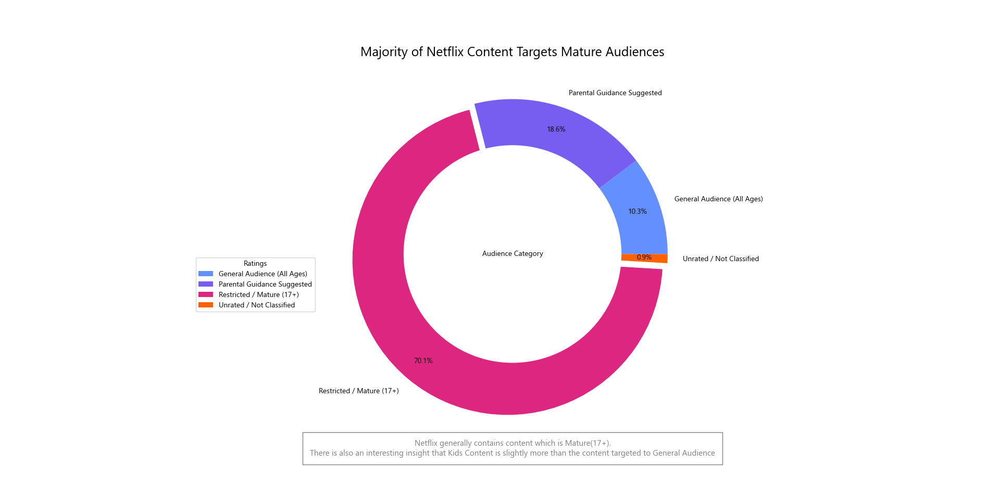
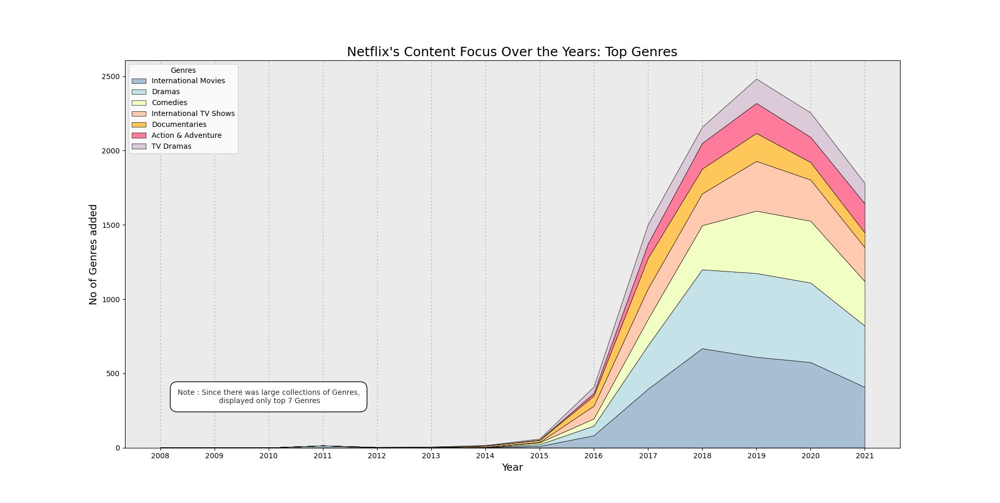
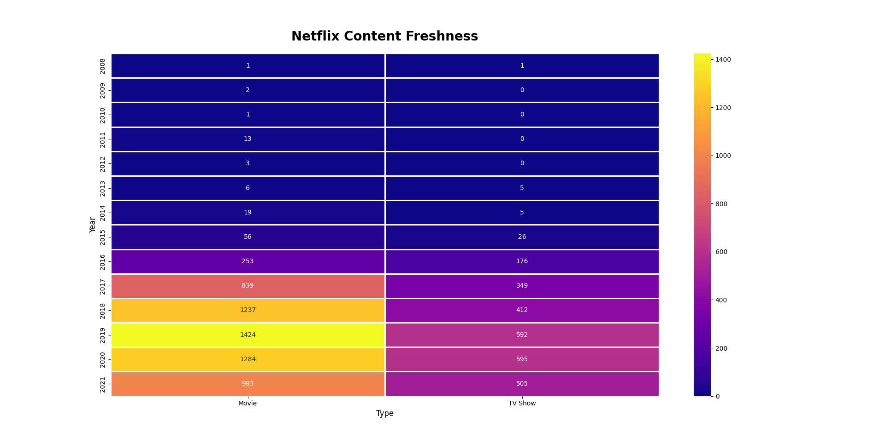
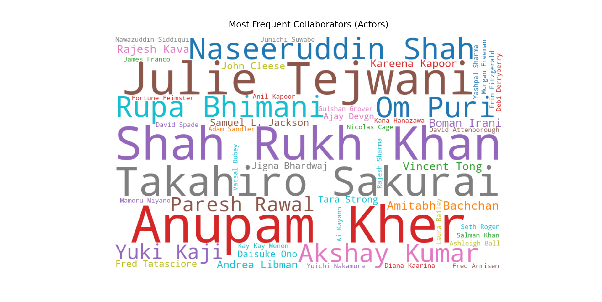

# 📊 Netflix Platform Data Analysis

A complete data analysis project using Python, Pandas, Seaborn, Matplotlib, and NumPy to generate meaningful insights.

## 🔍 Overview

This project analyzes the Netflix dataset to uncover trends, patterns, and insights through visual storytelling. 
This project explores trends in Netflix's global streaming content—analyzing genres, regional content contributions,
audience focus, and frequent actor collaborations.

## 🧠 Objectives

- Understand key trends in the data  
- Create clear, meaningful visualizations  
- Practice Python-based data analysis workflow  
- Extract real-world business or user insights

"Note: This dataset includes Netflix titles added until 2021. 
       While the data may not reflect the most recent releases, 
       it is still highly valuable for analyzing historical content trends,  
       platform growth, and strategic focus over time."

## 💡 Key Insights

- 📌 There was a very notable spike starting from the year 2015 to 2016 in content
     showing Netflix expansion however there was a dip notable from year 2019 

- 📌 United States of America,United Kingdom and India produce majorities of Netflix's Content  

- 📌 NetFlix generally contains content which is mature (17+).There is also an interesting insight that
     Kids Content is slightly more than the content targeted to General Audience

- 📌 Dramas and Action,Adventure dominate the platform, followed by Documentaries.

- 📌 Majority of Movies and TV SHows in Netflix were added between the years 2018,2019 & 2020 with 2020 being the peak year.

- 📌 Actors like Anupam Kher, Naseeruddin Shah, and Shah Rukh Khan dominate Netflix India's content while Actors like
     Takahiro Sakurai dominate Netflix Japanese content.

## 📈 Visualizations

Here are some charts generated in this project:

## 🛠️ Tech Stack

- Python 🐍
- Pandas
- NumPy
- Matplotlib
- Seaborn
- Jupyter Notebook

## 📁 Dataset Source

https://www.kaggle.com/datasets/shivamb/netflix-shows/data

## ✅ How to Run

1. Clone the repo  
2. Open `NETFLIX_DA.ipynb` in Jupyter or Colab
3. If you want you can run it in other IDEs like Pycharm and VSCode , just run the `NETFLIX_DA.py` file
4. Just uncomment each analysis function that you want to run

## 🙋‍♂️ Author

Made with 💙 by Yuv Bhatt (https://github.com/YuvBhatt-YB)

## 📌 License

This project is for educational and portfolio purposes only.
